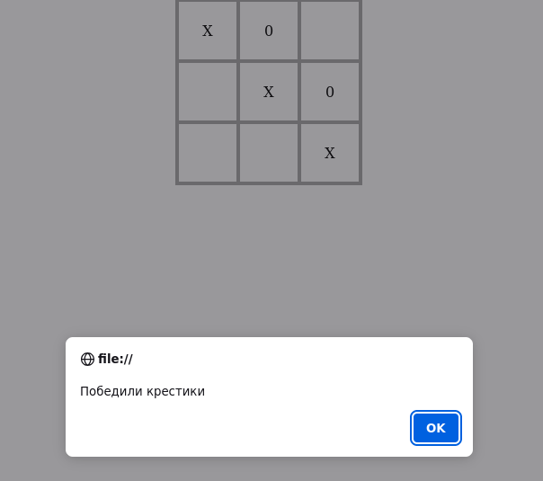

# ticTacToe.js

Simple implementation of the Tic Tac Toe game with JavaScript, HTML and CSS.

First step made by crosses, then players play after each other. When one of the players win, it shows the alert.

## Start

Open the `index.html` file in your browser.

##

Refresh the page to restart.
